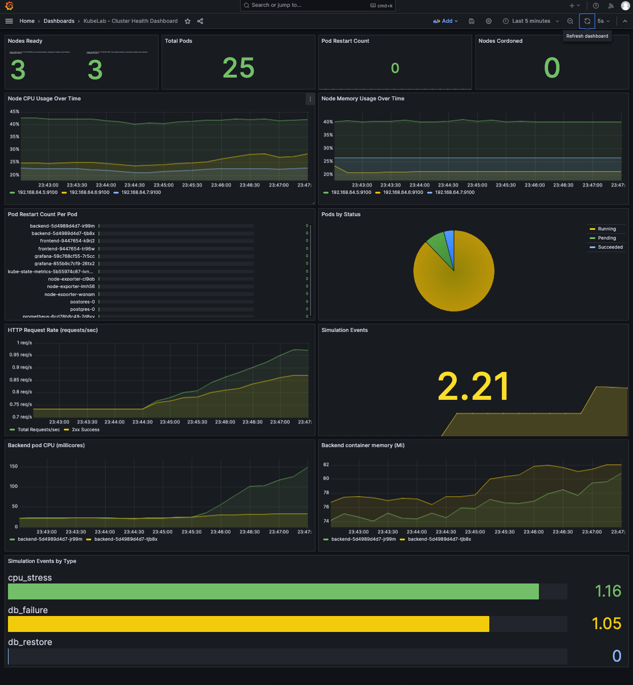

# Observability

Open Grafana next to the KubeLab UI — trigger simulations in one window, watch metrics in the other. Port-forwards:



| Service | Command | URL |
|---------|---------|-----|
| **Grafana** | `kubectl port-forward -n kubelab svc/grafana 3000:3000` | http://localhost:3000 |
| **Prometheus** | `kubectl port-forward -n kubelab svc/prometheus 9090:9090` | http://localhost:9090 |

Login: `admin` / `kubelab-grafana-2026`. Dashboard and data source auto-provision from ConfigMaps. Wait 2–3 min after deploy for first scrape.

## Dashboard Panels

| Panel | What it shows | Check during |
|-------|--------------|--------------|
| Nodes Ready | Count of ready nodes | Any sim |
| Total Pods | Total running pods | Any sim |
| Pod Restarts | Restart count (last hour) | OOMKill — watch count increment |
| **Nodes Cordoned** | Count of unschedulable nodes (cordoned) | **Drain Node** — 0 → 1 → 0 after Uncordon |
| Pod Status (Pods by Status) | Running / Pending / Failed | Any sim — state transitions |
| Backend pod CPU (millicores) | Per-pod CPU usage | **CPU Stress** — one pod flat at ~200m for 60s |
| Backend container memory (Mi) | Per-pod memory usage | **OOMKill** — line climbs, drops to 0, reappears |
| Node CPU / Memory | Node-level load | **Drain Node** — load shifts to remaining nodes |
| HTTP Request Rate | requests/s, 2xx vs 4xx/5xx | **DB Failure**, **Cascading**, **Readiness** — errors spike when backend or DB is down |
| Simulation Events (Last Hour) | Total sim events | Tracks which sims you've run |
| Simulation Events by Type | Breakdown by type (pod_kill, cpu_stress, etc.) | Tracks which sims you've run |

## Dashboard panels by simulation

Use this mapping to know which panels to watch for each simulation. All panels are on the single **KubeLab - Cluster Health Dashboard**; you don’t need a second dashboard.

| Simulation | Panels to watch | What you’ll see |
|------------|------------------|-----------------|
| **1. Kill Pod** | Pod Restart Count (Last Hour), Pod Restart Per Pod, Pods by Status, Total Pods | Restart count +1; brief gap in Pods by Status then recovery; Simulation Events (by type) shows `pod_kill` |
| **2. Drain Node** | **Nodes Cordoned**, Node CPU/Memory Over Time, Pods by Status, Total Pods | Nodes Cordoned → 1; load shifts on Node CPU/Memory; pods move off drained node |
| **3. OOMKill (Memory Stress)** | **Backend container memory (Mi)**, Pod Restart Count (Last Hour), Pod Restart Per Pod, Pods by Status | Memory line climbs toward 256Mi, drops to 0 (OOMKill), reappears; restarts +1; Simulation Events shows `memory_stress` |
| **4. DB Failure** | Pods by Status, Total Pods, HTTP Request Rate | postgres-0 gone then back; errors spike during outage; Simulation Events shows `db_failure` / `db_restore` |
| **5. CPU Stress** | **Backend pod CPU (millicores)**, Pod Restart Per Pod | One backend pod line flat at ~200m for ~60s; no restarts; Simulation Events shows `cpu_stress` |
| **6. Cascading Failure** | HTTP Request Rate (4xx/5xx), Pods by Status, Total Pods, Simulation Events | Error spike 5–15s; both backend pods gone then back; Simulation Events shows `kill_all_pods` |
| **7. Readiness Probe** | Pods by Status, Pod Restart Per Pod, HTTP Request Rate | No restarts; one pod out of rotation; errors spike only if both pods fail readiness; Simulation Events shows `readiness_fail` / `readiness_restore` |

## Prometheus Queries

Run at `http://localhost:9090` (after port-forwarding):

```promql
# Pod restart rate
rate(kube_pod_container_status_restarts_total{namespace="kubelab"}[5m])

# CPU throttle rate — invisible in Grafana by default
rate(container_cpu_cfs_throttled_seconds_total{namespace="kubelab"}[5m])

# Memory usage as % of limit
container_memory_usage_bytes{namespace="kubelab"}
  / container_spec_memory_limit_bytes{namespace="kubelab"}

# Pods not Running
kube_pod_status_phase{namespace="kubelab", phase!="Running"}

# Simulation events by type (use dashboard range, e.g. 15m)
sum by (type) (increase(simulation_events_total{job="kubelab-backend"}[$__range]))
```

## Troubleshooting

**Grafana shows "No data"**: Confirm Prometheus is Running; in Grafana: Connections → Data Sources → Prometheus → Save & Test.

**Login failed?** See [Grafana login](grafana-login.md).

**Dashboard not loading**: It auto-provisions on pod start. If missing, wait 30s and refresh.  
Force reload: `kubectl rollout restart deployment/grafana -n kubelab`

**`kubectl top` not working**: `microk8s enable metrics-server` on the control plane.

**Simulation ran but its type shows 0 (e.g. db_failure)**: The backend pod that handled that request **restarted** after the sim. In-memory Prometheus counters reset on process restart, so the count is lost. Run the simulation again; the dashboard should show the event (e.g. db_failure: 1) as long as that pod doesn’t restart again before the next scrape.

**Why some simulation types don't show in the dashboard**

| Simulation        | Shows in Grafana? | Why |
|------------------|-------------------|-----|
| CPU stress       | Yes               | Pod stays alive; counter is scraped. |
| DB failure       | Yes               | Pod stays alive; counter is scraped. |
| **Memory stress**| **Often no**      | The pod that increments the counter is the same pod that gets **OOMKilled**. It dies before (or right after) Prometheus' next 15s scrape, so the in-memory counter is never seen. |
| **Readiness fail** | Should show     | Pod stays Running (only readiness fails). Prometheus scrapes by **pod** (not Service), so the pod is still scraped. If it doesn't show: that pod may have restarted later (e.g. after a memory stress), wiping its metrics. |
| **DB restore**   | Should show       | Pod stays alive; code does increment `db_restore`. If it didn't show: time range might not include the click, or the pod that handled restore restarted afterward. |

**memory_stress** often missing (pod dies before scrape). **readiness_fail** / **db_restore**: use "Last 15 minutes", wait ~30s, refresh.

**Verification:** Prometheus http://localhost:9090 → Status → Targets (all up). Grafana → Data sources → Prometheus → Save & test. Dashboard time range "Last 15 minutes". Backend metrics: `kubectl exec -n kubelab deploy/backend -- wget -qO- http://localhost:3000/metrics | grep simulation_events_total`
